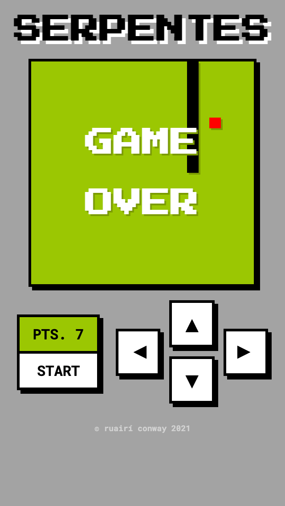

# SERPENTES

## Brief

A build of the game Snake using pure html, css, and vanilla js.

## View

- Live - https://ruairiconway.github.io/serpentes/
- Code - https://github.com/ruairiconway/serpentes

| --- | --- | --- |
|  |  |  |

## Points of interest
- Snake can be controlled using arrow keys or buttons.
- Buttons appear on mobile.
- Snake moves through grid of generated 'div's using logic to place snake and the direction it turns/is going.
- Snake grows + speed increases when apple is caught.
- Game ends when snake hits wall or self.

## Future Edits
- Add prompts on desktop to show how to play i.e. 'use keyboard arrows'.
- display arrow buttons on desktop for accessibility.
